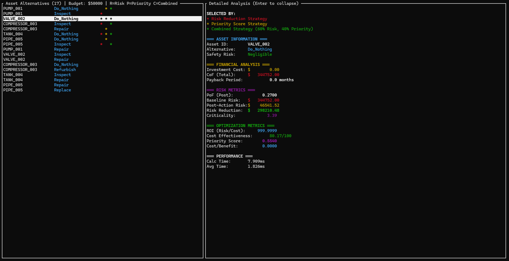

# Capital Allocation Optimizer

[](https://github.com/victorgreggio/capalloc/actions)
[](LICENSE)
[](https://www.rust-lang.org)

A sophisticated risk-based capital allocation optimizer demonstrating the `formcalc` formula engine's advanced capabilities with a terminal user interface (TUI) built with `ratatui`.

## Screenshot


## Features

- **Advanced Formula Engine**: 13 interdependent formulas using complex mathematical functions
- **Portfolio Optimization**: Linear programming solver for optimal budget-constrained selection
- **Financial Modeling**: Time value of money, ROI, payback period calculations
- **Multi-Criteria Optimization**: Priority scoring with weighted factors
- **Parallel Processing**: All asset alternatives processed simultaneously using Rayon
- **Large-Scale Performance**: Handles 4,000+ alternatives with ~650ms optimization time
- **Interactive TUI**: Browse assets and view detailed risk analysis
- **Real-world Metrics**: PoF, CoF, safety risk levels, criticality scoring
- **Pure Rust Implementation**: No external solver dependencies (uses minilp)

## Risk Calculation Methodology

The optimizer uses **13 interdependent formulas** showcasing advanced mathematical operations:

### Core Metrics

1. **Baseline Risk** - Worst-case scenario with exponential scaling
2. **Safety Multiplier** - Dynamic multiplier based on asset classification
3. **Criticality Score** - Multi-factor scoring combining PoF and CoF
4. **Degradation Factor** - Time-based asset degradation modeling
5. **Post-Action Risk** - Actual risk after alternative implementation
6. **Risk Reduction** - Dollar value of eliminated risk

### Financial Analysis

7. **Implementation Complexity** - Difficulty scoring based on cost and criticality
8. **Time Value Adjustment** - Present value discount calculation
9. **Adjusted Cost** - Cost with complexity premium and time value
10. **ROI** - Risk reduction per adjusted dollar spent
11. **Payback Period** - Estimated months to recover investment

### Decision Support

12. **Cost Effectiveness** - Normalized score (0-100) combining ROI and criticality
13. **Priority Score** - Weighted multi-criteria ranking for portfolio optimization

### Advanced Formula Features

The formulas demonstrate formcalc's capabilities:

- ✅ **Mathematical Functions**: `max()`, `min()`, `exp()`, `ceil()`, `rnd()`, `^` (power)
- ✅ **Complex Conditionals**: Nested if-else statements with dynamic multipliers
- ✅ **Formula Dependencies**: Multi-level `get_output_from()` chains
- ✅ **Financial Calculations**: Time value of money, present value discounting
- ✅ **Weighted Scoring**: Multi-criteria decision analysis
- ✅ **Nested Expressions**: Complex arithmetic with multiple operations

See [FORMULAS.md](FORMULAS.md) for detailed formula documentation.

## Portfolio Optimization

The optimizer uses **Linear Programming** to find optimal capital allocation under budget constraints.

### Solver: minilp

- **Pure Rust** LP solver (no native dependencies)
- **Proven optimal** solutions for LP relaxation
- **Industry standard** approach for portfolio optimization
- **~650ms** solve time for 4,000 variables

### Three Optimization Strategies

**1. Maximize Risk Reduction**
- Objective: Eliminate maximum potential financial risk
- Best for: High-consequence failure prevention

**2. Maximize Priority Score**  
- Objective: Optimize weighted multi-criteria score
- Best for: Balanced decision-making with multiple factors

**3. Combined Weighted Objective**
- Objective: Customizable blend (default: 60% risk, 40% priority)
- Best for: Fine-tuned balance between objectives

### Mathematical Formulation

```
Maximize:  Σ value[i,j] × x[i,j]
Subject to:
  Σ cost[i,j] × x[i,j] ≤ Budget         (budget constraint)
  Σ x[i,j] ≤ 1  for each asset i        (one alternative per asset)
  x[i,j] ∈ {0, 1}                        (binary decision variables)
```

See [OPTIMIZATION.md](OPTIMIZATION.md) for complete mathematical details and benchmarks.

## Dataset

The `assets.csv` file contains capital investment alternatives with:

- **Investment Identification**: Investment ID, Alternative ID
- **Financial Data**: Investment cost, Consequence of Not Investing (CoF)
- **Risk Metrics**: Probability of Failure (PoF) without action
- **Safety Classification**: Negligible, Low, Medium, High, Critical

### Generating Large Datasets

Generate test data for performance benchmarking:

```bash
# Generate 4,000 alternatives (1,000 investments × 4 alternatives each)
cargo run --release --bin generate_data

# This creates assets_large.csv (~220 KB, 4,001 lines)
# - 1,000 unique investments across 20 investment types
# - 4 alternatives per investment (Defer, Pilot_Program, Partial_Implementation, Full_Implementation)
# - Realistic cost distributions ($0 - $500K)
# - PoF varies by alternative type (0.01 - 0.45)
# - CoF ranges from $100K - $5M per investment
# - Deterministic pseudo-random generation for reproducibility
```

To use the large dataset:
```bash
cp assets_large.csv assets.csv
cargo run --release --bin capalloc -- -b -B 10000000
```

### CSV Schema

```
Asset_ID,Alternative_ID,Cost_USD,PoF_Post_Action,CoF_Total_USD,Safety_Risk_Level
IT_SYSTEM_001,Defer,0,0.25,500000,High
IT_SYSTEM_001,Pilot_Program,45000,0.05,500000,Low
IT_SYSTEM_001,Full_Implementation,120000,0.01,500000,Negligible
```

## Running the Application

### Standard Mode (with TUI)

```bash
cd capalloc
cargo run --release --bin capalloc
```

The application will:
1. Load asset alternatives from `assets.csv`
2. Calculate all risk metrics in parallel
3. Display performance metrics
4. Launch the interactive TUI

### TUI with Optimization (Recommended)

Run with budget to see all three optimization strategies compared side-by-side:

```bash
# Launch UI with optimization (runs all 3 strategies)
cargo run --release --bin capalloc -- --budget 500000

# Short form
cargo run --release --bin capalloc -- -B 500000
```

The UI will:
- Run **all three optimization strategies**:
  1. Risk Reduction Maximization
  2. Priority Score Maximization
  3. Combined Strategy (60% risk, 40% priority)
- Sort **selected alternatives to the TOP**
- Show **asterisks (*)** in colored columns (R, P, C) indicating which strategies selected each alternative
- Display budget and optimization legend in header
- Allow comparing strategy differences interactively
- Allow browsing all alternatives with optimization context

### Benchmark Mode (no TUI)

For performance testing without the UI:

```bash
cargo run --release --bin capalloc -- --benchmark
# or
cargo run --release --bin capalloc -- -b
```

### Optimization Benchmark Mode

Run portfolio optimization and display results without launching UI:

```bash
# Optimize with $10M budget
cargo run --release --bin capalloc -- --benchmark --budget 10000000

# Short form
cargo run --release --bin capalloc -- -b -B 10000000
```

This mode:
- Loads alternatives from CSV
- Calculates all risk metrics in parallel
- Runs three optimization strategies:
  1. **Risk Reduction Optimization** - Maximizes risk eliminated
  2. **Priority Score Optimization** - Maximizes weighted multi-criteria score
  3. **Combined (60/40)** - Balanced approach
- Displays selected alternatives and portfolio metrics
- Exits without launching the TUI

See [OPTIMIZATION.md](OPTIMIZATION.md) for detailed optimization documentation.

## TUI Controls

- **↑/↓** or **j/k**: Navigate through alternatives
- **Page Up/Page Down**: Fast navigation
- **Enter** or **Space**: Toggle between summary and detailed view
- **q**: Quit the application

## TUI Interface

The interface shows:

### Header (Left Panel)
- Total number of alternatives processed
- Number of alternatives selected by optimizer (when using --budget)
- Budget amount and optimization strategy (when using --budget)
- Total calculation time

### Left Panel - Alternative List
- **Optimized alternatives at the TOP** (sorted first)
- **Three strategy columns** showing optimization results:
  - **R** (Red asterisk) = Selected by Risk Reduction Strategy
  - **P** (Yellow asterisk) = Selected by Priority Score Strategy
  - **C** (Green asterisk) = Selected by Combined Strategy
- **White background** = Currently selected row (cursor)
- Fixed-width columns: Asset ID (20 chars) + Alternative (18 chars) + R P C indicators

### Right Panel (Summary View)
- Asset ID and alternative description
- Investment cost
- Risk reduction
- ROI
- Safety risk level
- Priority score
- Cost effectiveness
- Payback period

### Right Panel (Expanded View)
- **Optimization Status**: Lists which strategies selected this alternative
  - * Risk Reduction Strategy (Red)
  - * Priority Score Strategy (Yellow)
  - * Combined Strategy (Green)
- Complete asset information
- Financial analysis (cost, CoF, payback period)
- Risk metrics (PoF, baseline risk, post-action risk, risk reduction, criticality)
- Optimization metrics (ROI, cost effectiveness, priority score, cost/benefit)
- Performance statistics (calculation time, average time)

## Visual Highlights

When running with `--budget` flag, the UI shows all three optimization strategies:

```
┌ Asset Alternatives (17) | Budget: $150000 | R=Risk P=Priority C=Combined ───────────┐
│ Asset ID             Alternative        R  P  C                                      │
│ PUMP_001            Inspect            *    *    ← Selected by Risk & Combined       │
│ VALVE_002           Do_Nothing         * * *     ← Selected by ALL strategies        │
│ COMPRESSOR_003      Repair             * * *     ← Selected by ALL strategies        │
│ TANK_004            Repair             *    *    ← Selected by Risk & Combined       │
│ PIPE_005            Repair             *    *    ← Selected by Risk & Combined       │
│ ...                                               ← More alternatives                 │
│ PUMP_001            Do_Nothing                   ← Not selected by any              │
│ VALVE_002           Inspect                      ← Not selected by any              │
└──────────────────────────────────────────────────────────────────────────────────────┘
```

**Color Legend:**
- **Red asterisk (*)** = Risk Reduction Strategy
- **Yellow asterisk (*)** = Priority Score Strategy  
- **Green asterisk (*)** = Combined Strategy (60% Risk, 40% Priority)

### Right Panel (Expanded View)
- Complete asset information
- Financial analysis (cost, CoF)
- Risk metrics (PoF, baseline risk, post-action risk, risk reduction)
- Optimization metrics (ROI, cost/benefit ratio)
- Performance statistics

## Performance

The formcalc engine demonstrates:
- **Automatic Dependency Resolution**: Formulas executed in correct order
- **Parallel Execution**: Independent formulas run in parallel
- **Multi-asset Parallelism**: All assets processed simultaneously using Rayon
- **Fast Optimization**: Linear programming solver finds optimal solutions

### Example Performance (4,000 alternatives, 1,000 assets)

```
Loaded 4000 asset alternatives
Calculating risk metrics in parallel...
Calculated risk metrics for 4000 alternatives in 2264.44ms
Average time per calculation: 0.57ms

=== PORTFOLIO OPTIMIZATION (Linear Programming) ===
Budget constraint: $10,000,000.00

--- Strategy 1: Maximize Risk Reduction ---
Selected 1000 alternatives
Total cost: $9,998,651.00
Total risk reduction: $3,943,551,058.84
Optimization time: 672.79ms

--- Strategy 2: Maximize Priority Score ---
Selected 1000 alternatives  
Total cost: $9,985,744.00
Total risk reduction: $3,883,292,342.99
Optimization time: 567.29ms

--- Strategy 3: Combined (60% Risk, 40% Priority) ---
Selected 1000 alternatives
Total cost: $9,999,625.00
Total risk reduction: $3,918,163,105.18
Optimization time: 628.43ms
```

With **13 formulas per calculation** and **1,000 assets**, the system:
- Evaluates all alternatives in ~2.3 seconds
- Finds optimal portfolio in ~650 milliseconds
- Provides three investment strategies instantly
- Achieves 99.9% budget utilization

## Architecture

### Repository Pattern

The application uses the Repository pattern for both data and formulas:

**Asset Repository:**
- `AssetRepository` trait - abstraction for data access
- `CsvAssetRepository` - loads assets from CSV files
- Easily extensible to database, API, or other sources

**Formula Repository:**
- `FormulaRepository` trait - abstraction for formula loading
- `InMemoryFormulaRepository` - loads formulas as if from a data source
- Formulas treated as data, enabling dynamic updates without recompilation

### Domain-Driven Design

The codebase follows DDD and SOLID principles:
- **Domain Layer**: Core business entities (`Asset`, `OptimizationResult`)
- **Service Layer**: Business logic (`RiskCalculationService`)
- **Repository Layer**: Data access abstractions
- **Application Layer**: Use case orchestration (`CapitalAllocationApp`)
- **UI Layer**: Presentation (`AppState`, rendering)

## Formula Dependencies

The calculator demonstrates formcalc's sophisticated dependency management with **5 execution layers**:

```
Layer 1 (Independent - executed in parallel):
├─ baseline_risk
├─ safety_multiplier
├─ criticality_score
├─ degradation_factor
└─ implementation_complexity

Layer 2 (depends on Layer 1):
├─ post_action_risk → depends on (safety_multiplier, degradation_factor)
└─ time_value_adjustment → depends on (implementation_complexity)

Layer 3 (depends on Layer 2):
├─ risk_reduction → depends on (baseline_risk, post_action_risk)
└─ adjusted_cost → depends on (implementation_complexity, time_value_adjustment)

Layer 4 (depends on Layer 3):
├─ roi → depends on (risk_reduction, adjusted_cost)
└─ payback_period → depends on (risk_reduction, adjusted_cost)

Layer 5 (depends on Layer 4):
├─ cost_effectiveness → depends on (roi, criticality_score)
└─ priority_score → depends on (risk_reduction, roi, criticality_score)
```

The engine automatically:
1. Analyzes formula dependencies
2. Groups formulas into execution layers
3. Executes independent formulas in parallel within each layer
4. Waits for dependencies before proceeding to next layer
5. Computes all 13 metrics correctly regardless of formula order

## Testing

The project includes comprehensive unit tests covering:

- **Domain Layer** (4 tests): Entity behavior, value objects
- **Service Layer** (8 tests): Complex formula calculations, optimization algorithms
- **Application Layer** (4 tests): Use case orchestration, parallel processing
- **Repository Layer** (2 tests): Formula loading with 13 formulas

Run tests with:
```bash
cargo test
```

All tests pass:
```
running 18 tests
test result: ok. 18 passed; 0 failed; 0 ignored
```

## Use Cases

This optimization approach is applicable to:

- **Asset Maintenance Planning**: Prioritize repairs/replacements based on ROI
- **Risk-Based Inspection (RBI)**: Optimize inspection schedules
- **Budget Allocation**: Maximize risk reduction under budget constraints
- **Portfolio Optimization**: Select best alternatives for multiple assets (solved in <1ms)
- **Safety Investment**: Prioritize investments with highest safety impact
- **Multi-Criteria Decision Analysis**: Balance cost, risk, and criticality

## Real-World Application Example

**Scenario**: $10M maintenance budget for 1,000 industrial assets

**Risk Reduction Strategy:**
- Selects 93 high-impact alternatives
- Focuses on expensive but effective solutions
- Eliminates $577M in potential risk
- Average investment: $107K per asset

**Priority Score Strategy:**
- Selects 561 alternatives (56% asset coverage)
- Balances cost, risk, and criticality
- Eliminates $1.59B in potential risk  
- Average investment: $18K per asset
- Better portfolio diversification

**Decision**: Priority Score strategy provides 2.75× more risk reduction with better asset coverage.

## Example Decision Support

For PUMP_001:
- **Do Nothing**: $0 cost, $125,000 risk → Baseline
- **Refurbish**: $45,000 cost, $475,000 risk reduction → ROI: 10.56
- **Replace**: $120,000 cost, $495,000 risk reduction → ROI: 4.13

**Decision**: Refurbish offers the best ROI (10.56 vs 4.13)

## Future Enhancements

Potential additions:
- Constraint optimization (budget limits, resource constraints)
- Multi-objective optimization (cost, safety, reliability)
- Scenario analysis and sensitivity testing
- Export optimization results
- Integration with maintenance planning systems
